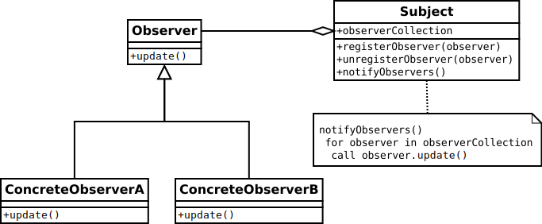

# The Observer Pattern


### What is it?
The observer pattern is a software design pattern in which an object, named the subject, maintains a list of its dependents, called observers, and notifies them automatically of any state changes, usually by calling one of their methods.

### Use Case
When many objects (observers) need to know when the state of an object (subject) changes. The subject doesn't care who the observers are. It's more of a "fire and forget" model. 


### Implementation


Unity Events can be used to set up the observer pattern but below we will demonstrate implementing the pattern with delegates. 

A more generic C# approach can be implemented using delegates.

#### Observer Pattern with Delegates

**Level.cs**
```C#
    using System;
    using System.Collections;
    using UnityEngine;
    using UnityEngine.Events;

    public class Level : MonoBehaviour {

        [SerializeField] int pointsPerLevel = 200;
        int experiencePoints = 0;

        public event Action onLevelUpAction;
        public event Action onExperienceChange;

        public void GainExperience(int points)
        {
            int level = GetLevel();
            experiencePoints += points;
            if (onExperienceChange != null)
                onExperienceChange();

            if (GetLevel() > level)
                if (onLevelUpAction != null)
                    onLevelUpAction();
        }

        public int GetExperience() => experiencePoints;

        public int GetLevel() => experiencePoints / pointsPerLevel;
    }

```

**Health.cs**
```C#
    using System;
    using System.Collections;
    using UnityEngine;

    public class Health : MonoBehaviour {

        [SerializeField] float fullHealth = 100f;
        [SerializeField] float drainPerSecond = 2f;
        float currentHealth = 0;

        public event Action onHealthChange;

        void Awake() {
            ResetHealth();
            StartCoroutine(HealthDrain());
        }
        
        void OnEnable() {
            GetComponent<Level>().onLevelUpAction += ResetHealth;
        }

        void OnDisable() {
            GetComponent<Level>().onLevelUpAction -= ResetHealth;
        }

        public float GetHealth() => currentHealth;

        public float GetFullHealth() => fullHealth;

        void ResetHealth()
        {
            currentHealth = fullHealth;
            if (onHealthChange != null)
                onHealthChange();
        }

        IEnumerator HealthDrain()
        {
            while (currentHealth > 0)
            {
                currentHealth -= drainPerSecond;
                if (onHealthChange != null)
                    onHealthChange();

                yield return new WaitForSeconds(1);
            }
        }
    }

```


 

